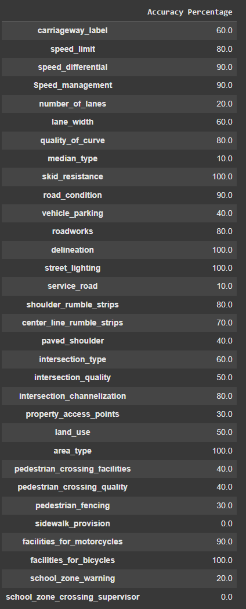

# Experiment 0001: Zero-shot `gemini-1.5-flash`

<i>Oct 09 2024</i> 
Author: Ahmed Abdelhay 
Reviewed By: _____________

## Objective
This Experiment aims to test the performance of gemini-1.5-flash model prompted with the zero-shot prompt in `prompt_template.txt`  

## Prompt-Template [[file](./../shred-files/prompt_template.txt)]
The prompt is divided in 4 parts. 
1. We explain to the model it's roll and how it should read the prompt to get most efficiency. 
2. Second part (DISCRETION) contains the label description according to the iRAP Manual.
3. Third part (CODE) represents the coding of the label according to the iRAP Manual.
4. The last Section (INSTRUCTION) ** I think This should be INSTRUCTIONS as a plural** 
In this section we provide the model with the instructions to solve get the label code in steps.

## Experiment Setup
- prompting was down over the 10 images fetched using Google street view for Australia Brisbane city

## Methodology
### Approach
- Generate Zero-shot prompts according to the template in `prompt_template.txt` 
- Prompt `gemini-1.5-flash` model using `google.generativeai` library.
- Collect pre-processed responses in a CVS file `zero-shot.csv`
- Model parameters were set to the defaults of `google.generativeai` library.

## Results
- Percentages of accurate prediction for labels 

- Graphical Representation for true-values percentages.

## Source Code
- Full experiment notebook: https://colab.research.google.com/drive/1cUJswxe9s72Wyl6KivBNHGffaa7BDS8M?usp=sharing